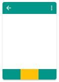

# 前端设计
## 总体界面
- eg. 
- 底部导航栏
- 左上角返回按钮（除三个基本层外的层都有）
- 右上角操作列表（如果没有说明，则没有）
- 下方导航栏（基本层）
    - 信息
    - 订单
    - 我的
---
## 信息界面
- 操作列表
    - 排序
        - 按赏金金额降序
        - 按发布者评分降序
        - 按预计所需时间降序
        - 按截止时间降序
        - 按截止时间升序
    - 筛选
        - 出现一个【筛选界面】，筛选各种信息
- 展现若干行信息，每条信息包括
    - 发布人姓名（半匿名）
    - 发布人评分
    - 截止时间
    - 预计所需时间
    - 赏金
    - 跑腿类型
- 查看按钮
    - 单击出现一个【详细信息界面】，展现该条的具体信息，包括上条所述，还有跑腿的具体内容，跑腿需要花费的金额，发布时间等
## 筛选界面
- 参考淘宝搜索页面的筛选功能，可选
## 详细信息界面
- 如上所述
- 接单按钮
    - 单击一次，按钮下面出现确认信息和一个确认接单按钮
- 确认接单按钮
    - 接单成功，移除当前覆盖层，出现【订单详细界面】
---
## 订单界面
分两部分，按页面切换
- 我发布的信息
    - 展现若干行信息，与信息界面类似
    - 显示当前状态：等待接取、正在进行、已完成、已取消
    - 查看按钮
        - 单击出现【我发布的详细信息界面】，展现具体信息
- 我接取的订单
    - 展现若干行信息，与信息界面类似
    - 显示当前状态：正在进行、已完成、已取消
    - 查看按钮
        - 单击出现【我接取的详细订单界面】，展现具体信息
## 我发布的详细信息界面
- 展现详细信息
- 完成按钮
    - 单击后弹出确认对话框，若确认，则完成
- 取消按钮
    - 单击后弹出确认对话框，若确认，则取消
- 若该信息为“正在进行”状态，还需要显示接单人的姓名、手机号等信息
## 我接取的详细订单界面
- 展现详细信息
- 取消按钮
    - 单击后弹出确认对话框，若确认，则取消
- 若该订单为“正在进行”状态，还需要显示下单人的姓名、手机号等信息
---
## 我的界面
- 如果没有登录，则出现【登录界面】
- 显示所有个人信息，半匿名显示
- 修改密码，出现【修改密码界面】
- 退出登录，出现【登录界面】
## 登录界面
- 学号、密码
- 注册，出现【注册界面】
- 忘记密码，出现【忘记密码界面】
- 登录按钮，若登录成功，出现【我的界面】
## 注册界面
- 学号、密码
- 手机号
- 真实姓名
- 年级
- 院系
- 校园卡照片
## 修改密码界面
- 原密码，新密码，新密码确认，手机号
- 修改按钮
## 忘记密码界面
- 可选